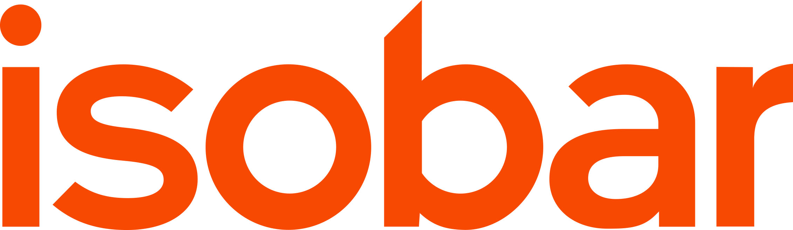

# Command queue library

This library delivers basic interfaces and tools to create command backend delegation system, which allows
passing tasks for processing by scallable backend worker infrastructure.

[](https://travis-ci.org/Gendoria/command-queue)
[](https://scrutinizer-ci.com/g/Gendoria/command-queue/?branch=master)
[](https://scrutinizer-ci.com/g/Gendoria/command-queue/?branch=master)
[](https://packagist.org/packages/gendoria/command-queue)
[](https://packagist.org/packages/gendoria/command-queue)

Library created in cooperation with [Isobar Poland](http://www.isobar.com/pl/).

 

## Installation

### Step 1: Download the library


Open a command console, enter your project directory and execute the
following command to download the latest stable version of this bundle:

```console
$ composer require gendoria/command-queue "dev-master"
```

This command requires you to have Composer installed globally, as explained
in the [installation chapter](https://getcomposer.org/doc/00-intro.md)
of the Composer documentation.

## Usage

No usage instructions yet.